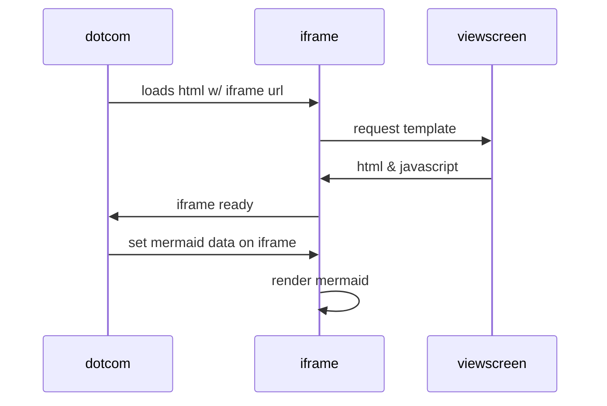
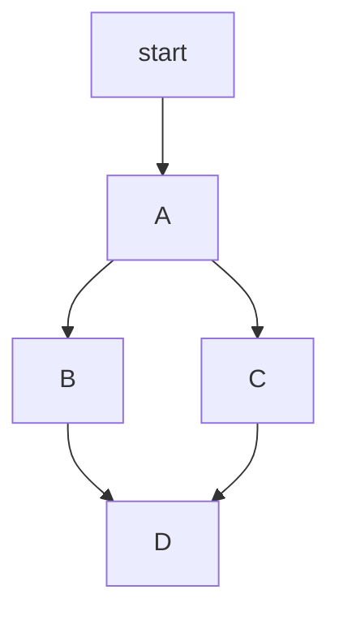

[mermaid naudojimo aprašas](https://github.blog/developer-skills/github/include-diagrams-markdown-files-mermaid/)

[mermaid sintaksė](https://mermaid.js.org/intro/syntax-reference.html#syntax-structure)

````

````


````

````


