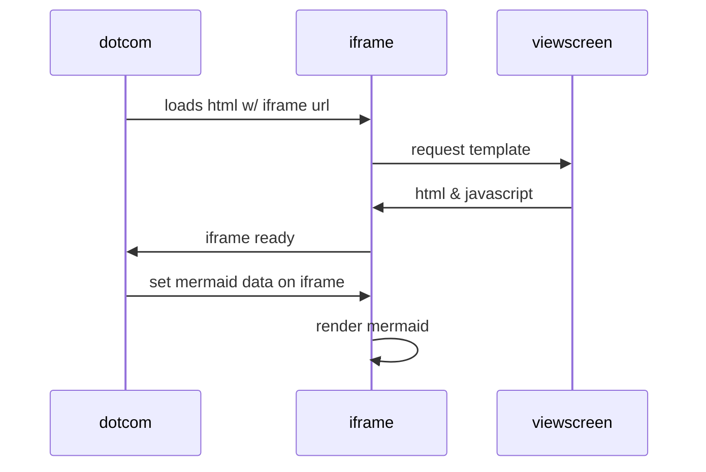
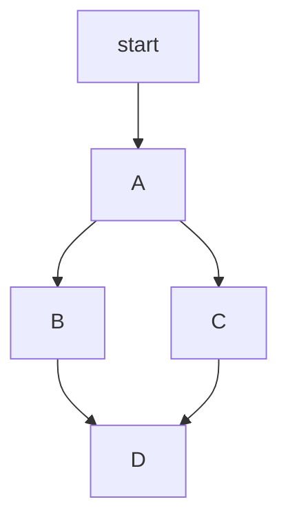

[mermaid naudojimo aprašas](https://github.blog/developer-skills/github/include-diagrams-markdown-files-mermaid/)

[mermaid sintaksė](https://mermaid.js.org/intro/syntax-reference.html#syntax-structure)

[mermaid live editor ](https://mermaid.live/edit#pako:eNpVjU1Pg0AQhv_KZk6a0KZ8FOgeTCzVXprowZPQw6QMLLHskmVJrcB_d6Ex6px29nned3o4qZyAQ3FWl5NAbdjbLpPMzmOaCF21psb2yBaLh2FPhtVK0nVg27u9Yq1QTVPJ8v7mbyeJJf1h0ogZUcmP8YaSOf8iaWC79ICNUc3xL3m7qIE9pdWrsPX_idBkU89pgbzAxQk1S1DPCjhQ6ioHbnRHDtSka5xW6CeagRFUUwbcPnMqsDubDDI52liD8l2p-iepVVcKsPXn1m5dk6OhXYWlxl-FZE46UZ00wL1grgDewydw342Wa38TxVHgrfzN2oGr_fSX69U0keu7XhiHowNf88nVMo5m5MahFwZBtBm_AU0Qdmg)

````

````


````

````


